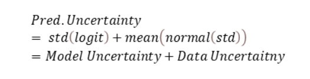
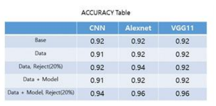

# 머신러닝 모델에서의 예측 불확실성과 거부 메커니즘

## 개요

이 프로젝트는 머신러닝 모델에서 예측 불확실성을 측정하고 관리하는 방법을 소개합니다.
특히, 예측의 신뢰도를 향상시키기 위해 불확실한 예측을 거부(reject)하는 메커니즘에 중점을 두고 있습니다.
이 방식은 의료 진단과 같은 고위험 응용 분야에서 유용합니다.

## 주요 개념

1. **예측 불확실성**:
    - 예측 불확실성은 모델이 자신의 예측에 대해 얼마나 확신을 가지고 있는지를 나타냅니다. 불확실성에는 두 가지 주요 유형이 있습니다:
        - **데이터 불확실성(Aleatoric Uncertainty)**: 데이터 자체에 내재된 불확실성으로, 모델이 개선되더라도 줄일 수 없는 불확실성입니다.
        - **모델 불확실성(Epistemic Uncertainty)**: 모델이 충분한 정보를 가지고 있지 않아 발생하는 불확실성으로, 더 많은 데이터나 개선된 모델을 통해 줄일 수 있습니다.

2. **거부 (reject) 옵션**:
    - 모델이 예측한 결과의 불확실성이 높은 경우, 해당 예측을 거부하는 메커니즘입니다. 이 방식은 의료와 같은 중요 분야에서 잘못된 예측으로 인한 위험을 줄이는 데 유용합니다.
    - **불확실성 기준 설정**: 정규화된 표준편차 값이 일정 임계값을 초과하면, 해당 예측을 신뢰할 수 없다고 판단하고 거부합니다.

3. **정규화(Normalization)**:
    - 예측 불확실성의 정확한 평가를 위해 후술할 앙상블에서 구해진 logit 값과 표준편차를 정규화하는 과정이 필요합니다.
    - 이 과정은 불확실성이 높은 예측을 더욱 정확하게 식별하고, 효과적으로 거부하는 데 중요한 역할을 합니다.

## 구현
**uncertainty.ipynb** 파일은 실제 실험에 사용한 코드가 아닌 **핵심 로직만 재구현**한 코드입니다. 
1. **세가지 모델**
   - 거부(reject) 옵션의 성능 향상 확인을 위한 대조군 실험
   - CNN, Alexnet, VGG11 모델에서 FMnist 데이터셋의 분류화 모델을 학습 후 테스트


2. **데이터 불확실성(Aleatoric Uncertainty)**:
   - 참고문헌[1]에 따라 데이터 불확실성은 분류 모델에 추가로 모델의 표준편차를 포착하게끔 모델링함으로써 구할 수 있습니다.
```python
...
 for i, (imgs, labels) in enumerate(train_loader):
     imgs, labels = imgs.to(device), labels.to(device)

     sampling_outputs = model(imgs)
     sampling_logit, sampling_std = sampling_outputs[:, :class_num], sampling_outputs[:, class_num : ]

     x = torch.zeros(10)
     e = torch.normal(x, 1).to(device)
     noised_outputs =  sampling_logit + sampling_std * e
     loss = criterion(noised_outputs, labels)
...
        
```
   - 데이터 불확실성은 로짓의 표준편차로 스케일링된 가우시안 노이즈로 모델링할 수 있습니다. 
   - 이 떄의 표준편차는 두가지 모델링의 변화를 통해 포착할 수 있습니다.
     - 1. 예를 들어, 10개의 분류 모델의 마지막 레이어를 10개의 아웃풋에서 20개의 아웃풋을 내는 것으로 수정 (10개의 로짓 -> 10개의 로짓 + 10개의 표준편차)
     - 2. 로스 함수에 기존의 아웃풋이 아닌 기존에 아웃풋에 표준편차로 스케일링된 가우시안 노이즈로 노이즈된 아웃풋을 적용  

2. **모델 불확실성(Epistemic Uncertainty)**:
   - 참고문헌[1]에 따라 모델 불확실성을 표현하는 한 방식으로 베이지안
     딥러닝 기법이 있습니다. 기존의 딥러닝 기법이
     deterministic 하게 파라미터를 정하던 것에 반해,
     베이지안 딥러닝 기법은 파라미터의 distribution 을
     추정합니다.
   - 단, MAP 방식은 비용이 비싸므로 참고문헌[2]에 따라 MC drop out으로 각각의 레이어에 걸려 있는 dropout layer 를
     예측에서도 그대로 사용하여 여러 개의 모델을 통해 예측하는 ensemble 의 효과를 냅니다.
   - 앙상블된 모델은 한번의 예측에 앙상블된 수만큼 결과가 나온는데, 이들의 표준편차가 모델 불확실성입니다.
   
```python
# Train Mode For MC Drop out
model.train()
T = 10
rr = 0.1
sm = torch.nn.Softmax(dim = 1)

with torch.no_grad():
   correct = 0
   safe_correct = 0
   total = 0
   reject = 0
   for i, (imgs, labels) in enumerate(test_loader):
      imgs, labels = imgs.to(device), labels.to(device)

      ## Sampling
      sampling_out = torch.zeros([T, len(imgs), len(test_data.classes)]).to(device)

      for t in range(T):
         sampling_out[t] = model(imgs)

      # ouputs => 100 x 10 # outputs_std => 100 x 10 # outputs_prob 100 x 10
      outputs = torch.mean(sampling_out, dim = 0)
      outputs_std = torch.std(sampling_out, dim = 0)
      outputs_prob = sm(outputs)
      ...
```

3. 예측 불확실성


 - 모델링, 모델 학습의 수정을 통해 데이터 불확실성을 포착합니다.
 - MC drop out을 이용한 앙상블로 모델 불확실성을 포착합니다.
 - 위 두가지 불확실성을 동시에 포착하여 하나로 합친 것이 예측 불확실성입니다.


4. **예측 불확실성 - 정규화**:
```python
 #  분산 리스케일링
max_std_normalize = torch.zeros_like(max_std)
for i in range(len(imgs)):
    max_std_normalize[i] = max_std[i] * 1/max_prob[i]
```
 -  모델 불확실성에서 표준 편차는 모델의 logit 값에 비례해 커지는 경향을 보입니다. 
 - 앙상블의 표준편차를 logit의 평균값으로 정규화하여 다양한 모델에서의 보편적인 reject 옵션 지표를 산출합니다.
   
5 **불확실성 계산 및 거부 옵션 적용**:
    - 정규화된 표준편차가 높아 불확실성이 큰 경우 예측을 거부하고, 나머지 예측만을 최종 결과로 사용합니다.
   

## 실험 결과
<p align="center">
  
</p>

본 연구에서 제안한 예측 불확실성 평가 및 거부 메커니즘의 효과를 확인하기 위해 다양한 실험을 진행하였습니다.

### 1. 모델 성능
- **기본 성능**: FashionMNIST 데이터셋을 사용하여 다양한 모델(CNN, AlexNet, VGG11)에서 실험을 진행한 결과, 제안한 방식이 기존 모델과 비교해 유사한 성능을 보였으나, 복잡도의 증가로 인해 일부 모델에서는 성능이 다소 낮아지는 결과가 나타났습니다.
- **거부 옵션 적용 전**: 기존 베이스 모델어서의 예측 정확도는 평균 92% 수준으로 나타났습니다.

### 2. 거부 옵션 적용 후
- **거부 옵션 적용**: 예측 불확실성이 높은 예측을 거부한 경우, 나머지 예측에 대한 성능이 향상되는 것을 확인했습니다. 예를 들어, 예측의 상위 20% 불확실성을 가진 예측을 거부했을 때, 남은 예측의 정확도가 평균 2 ~ 4%p 향상되었습니다.
- **정규화의 효과**: 정규화된 표준편차를 활용하여 불확실성을 평가한 결과, 정규화 전보다 더욱 더 안정적으로 accuracy 그래프가 올라 오는 것을 확인할 수 있었고 실제로 4%p 더 정확한 분류가 가능했습니다.


## 기대

이 프로젝트의 결과물은 의료 진단, 자율주행, 금융 시스템 등 한 번의 실수가 큰 문제를 일으킬 수 있는 분야에서 신뢰할 수 있는 예측을 제공하는 데 사용될 수 있습니다. 예측 불확실성을 효과적으로 관리함으로써, 안전성을 높이고 잘못된 의사결정으로 인한 위험을 줄일 수 있습니다.

## 참고문헌
- [1] Kendall, A., & Gal, Y. (2017). What uncertainties
do we need in bayesian deep learning for computer
vision?. arXiv preprint arXiv:1703.04977.

- [2] Gal, Y., & Ghahramani, Z. (2016, June). Dropout
as a bayesian approximation: Representing model
uncertainty in deep learning. In international
conference on machine learning (pp. 1050-1059).
PMLR.
